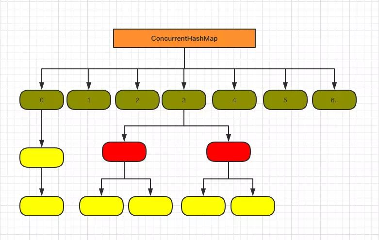

## HashMap和他的小伙伴们以及他们的内脏

##### HashMap的数据结构


```java
//如图,HashMap由数组和链表组成.数组存着链表的头节点.
//节点结构均为:
static class Node<K,V> implements Map.Entry<K,V> {
        final int hash;
        final K key;
        V value;
        Node<K,V> next;
}
//数组声明:
transient Node<K,V>[] table;	//注:数组长度n永远为2的倍数,默认16,并注意到 (n - 1)的二进制是全1的
//红黑树节点(1.8特性,链表过长会变为红黑树)
static final class TreeNode<K,V> extends LinkedHashMap.Entry<K,V> {
        TreeNode<K,V> parent;  // red-black tree links
        TreeNode<K,V> left;
        TreeNode<K,V> right;
        TreeNode<K,V> prev;    // needed to unlink next upon deletion
        boolean red;
}
```

##### 遍历

**遍历方式**: 分为**foreach**和**iterator**两种, *foreach效率好一点*. 这是方式上面的区别, 还有在使用的遍历因子的不同;
**遍历因子**: 按照遍历因子来划分, 则有**keySet()**和**entrySet()**两种, map的内部功能有Map.Entry接口实现, keySet()是直接取到keys, entrySet是首先取到每一个entry, 然后使用entry的getKey() 和 getValue()来完整的实现遍历, 速度要更好.

**快速失败**:是java集合中的一种机制， 在用迭代器遍历一个集合对象时，如果遍历过程中对集合对象的内容进行了修改(增加、删除、修改),则会抛出Concurrent Modification Exception。

##### public V put(K key, V value) 所做的工作

```java
/**1:求key的hash.
此法实际上是将key的hash值的高16位与低16位相异或,由于下一步的取模运算用的是与运算,而且位置很低,如果不用这一步,高位就无法参与到散列过程,会提高碰撞率
*/
static final int hash(Object key) {
        int h;
        return (key == null) ? 0 : (h = key.hashCode()) ^ (h >>> 16);	//注:null的hash为0
}
/**2:对hash取模,得到应该插入的数组的下标
此法将(数组长度 - 1)与1中的hash相与.数组长度为2的倍数,所以n - 1的二进制全1,相与就可以保证所有的值都能够取到.若非如此,如1011,则0所在位置为1的hash值散列出来永远为0,导致某些hash无法通过与运算的方法产生.*/
if ((p = tab[i = (n - 1) & hash]) == null)
            tab[i] = newNode(hash, key, value, null);
//3:如果发现碰撞
Node<K,V> e;//e是待替换节点的指针
	//a:key也相同,则直接替换
if (p.hash == hash && ((k = p.key) == key || (key != null && key.equals(k))))
						e = p;
	//b:key不同,但是被碰撞的是红黑树的根,则进入插入树的流程,返回待替换节点
e = ((TreeNode<K,V>)p).putTreeVal(this, tab, hash, key, value);
	//c:key不同,被碰撞的也不是红黑树的根,则遍历链表.遍历过程中,长度超限则改树,发现情况a则按a处理,最后新节点插入到尾部,注意是尾部,1.8里的做法!1.7之前则是头部
//4:若e非null,替换e的value,并返回老value
if (e != null) { // existing mapping for key
  V oldValue = e.value;
  return oldValue;
}
//5:更新长度,超限则扩容
++modCount;
if (++size > threshold)
  resize();
```

##### public V get(Object key) 所做的工作

```java
//1:求hash,再映射,同put
//2:table对应位置key相同,则返回
//3:不同,且为TreeNode,进入查树过程
//4:不同,非TreeNode,则遍历链表
//5:以上皆无,返回null
```

##### 加载因子

默认0.75,元素 >= 加载因子*当前容量 则出发扩容

##### 扩容操作,当表内元素大于0.75容量执行resize()

```java
//jdk<=1.7
//建立新表,表容量为原先2倍,旧表节点重新散列至新表中,插入在链表的头部
//jdk>1.7
//对旧表数组中的每个链表
//1:链表只有1个节点,则直接重新hash进入新表		//此处省略红黑树
//2:链表不止一个节点
		//对每个节点
			//a:求hash值,与老表length相与,确定是否需要移动
					// 示例1：
							// e.hash=10 0000 1010
							// oldCap=16 0001 0000
							//	 &   =0	 0000 0000       比较高位的第一位 0
							//结论：元素位置在扩容后数组中的位置没有发生改变
					// 示例2：
							// e.hash=17 0001 0001
							// oldCap=16 0001 0000
							//	 &   =1	 0001 0000      比较高位的第一位   1
							//结论：元素位置在扩容后数组中的位置发生了改变，新的下标位置是原下标位置+原数组长度
			//b:不需要移动的节点形成一个新的链表lo,需要移动的节点形成一个新的链表hi
			//c:lo的头节点直接给新链表,hi的头节点给在新链表中平移老链表长度
					newTab[j] = loHead;
					newTab[j + oldCap] = hiHead;

```

总结：1.8中 旧链表迁移新链表    链表元素相对位置没有变化; 
在1.7中  旧链表迁移新链表        如果在新表的数组索引位置相同，则链表元素会倒置

##### 红黑树转化(待补充)

```java
//链表长度大于8则转化为红黑树,8这个数字是作者按照泊松分布算出来的
```

##### HashMap的并发表现

```java
//并发使用HashMap时,多个线程同时调用resize()时,会导致出现环形链表.
//详见https://www.cnblogs.com/wang-meng/p/7582532.html
```

##### 进一步压榨HashMap性能

1:初始化时,长度要大于我们预计数据量的 1.34 倍,从而减少扩容可能

2:选择适当加载因子,加载因子越大，对空间的利用更充分，但是查找效率会降低（链表长度会越来越长）；如果加载因子太小，那么表中的数据将过于稀疏（很多空间还没用，就开始扩容了），对空间造成严重浪费。

3:key值相等的判断顺序是先判断key.hashCode()相等,再判断key.equals()相等.因此,想办法尽量使不相等的对象HashCode都不相同,可以大大减少计算量

##### 安全的使用HashMap

1:尽量使用wrapper类作为key,或将可能导致hashCode的field尽量设置为final,以防hashCode更改

2:保证线程安全,HashMap原则上是线程不安全的,可用concurrentHashMap或HashTable代替

### 它的小伙伴们

##### ConcurrentHashMap	(为线程安全而生,是HashTable的后辈)

1.7:

###### 数据结构:


​	

```java
/**
* Segment 数组，存放数据时首先需要定位到具体的 Segment 中。
*/
final Segment<K,V>[] segments;
transient Set<K> keySet;
transient Set<Map.Entry<K,V>> entrySet;

//Segment 是 ConcurrentHashMap 的一个内部类，主要的组成如下：
static final class Segment<K,V> extends ReentrantLock implements Serializable {
	private static final long serialVersionUID = 2249069246763182397L;
}

//HashEntry 的组成,和HashMap里的Node差不多
```

和 HashMap 类似，唯一的区别就是其中的核心数据如 value ，以及链表都是 volatile 修饰的，保证了获取时的可见性。原理上来说：ConcurrentHashMap 采用了分段锁技术，其中 Segment 继承于 ReentrantLock。不会像 HashTable 那样不管是 put 还是 get 操作都需要做同步处理，理论上 ConcurrentHashMap 支持 CurrencyLevel (Segment 数组数量)的线程并发。每当一个线程占用锁访问一个 Segment 时，不会影响到其他的 Segment。

###### put流程

首先是通过 key 定位到 Segment，之后在对应的 Segment 中进行具体的 put。虽然 HashEntry 中的 value 是用 volatile 关键词修饰的，但是并不能保证并发的原子性，所以 put 操作**前**仍然需要加锁处理。

###### put加锁

1:尝试获取锁，如果获取失败肯定就有其他线程存在竞争，则利用 `scanAndLockForPut()` 自旋获取锁。

2:尝试自旋获取锁。`trylock()`

3:若重试的次数达到了 `MAX_SCAN_RETRIES` 则改为阻塞锁获取，保证能获取成功。`lock()`

###### get流程

只需要将 Key 通过 Hash 之后定位到具体的 Segment ，再通过一次 Hash 定位到具体的元素上。由于 HashEntry 中的 value 属性是用 volatile 关键词修饰的，保证了内存可见性，所以每次获取时都是最新值。**整个过程都不需要加锁**。

1.8:

###### 数据结构:


###### 改进

1.7查询遍历链表效率太低,所以抛弃了原有的 Segment 分段锁，而采用了 `CAS + synchronized` 来保证并发安全性。

取消了 ReentrantLock 改为了 synchronized

###### put流程

类似于hashMap的put过程,

`f` 即为当前 key 定位出的 Node，如果为空表示当前位置可以写入数据，**利用 CAS 尝试写入，失败则自旋保证成功。**

##### HashTable(也为线程安全而生,很类似于HashMap)

每个方法中都加入了Synchronize

有`contains()`方法,而HashMap没有

不允许null值

HashTable中hash数组默认大小是11，增加的方式是 old*2+1。

##### LinkedHashMap(为了让数据有序,默认是插入序,继承自HashMap)

###### 数据结构


类似HashMap,节点多了2个指针指向前后项以构成有序序列,对**实现lru有重大意义**

###### 有序方式

插入序和访问序,按访问序排序就是lru

###### 双向链表的重排序

```java
访问序排序,则在get中也要做//当key如果已经存在时，则进行更新Entry的value。        
for (Entry<K,V> e = table[i]; e != null; e = e.next) {
  Object k;
  if (e.hash == hash && ((k = e.key) == key || key.equals(k))) {
    V oldValue = e.value;
    e.value = value;
    // 重排序
    e.recordAccess(this);
    return oldValue;
  }
}
//主要看e.recordAccess(this)，这个方法跟访问顺序有关，而HashMap是无序的，所以在HashMap.Entry的recordAccess方法是空实现，但是LinkedHashMap是有序的,LinkedHashMap.Entry对recordAccess方法进行了重写。
void recordAccess(HashMap<K,V> m) {
  LinkedHashMap<K,V> lm = (LinkedHashMap<K,V>)m;
  // 如果LinkedHashMap的accessOrder为true，则进行重排序
  // 比如前面提到LruCache中使用到的LinkedHashMap的accessOrder属性就为true
  if (lm.accessOrder) {
    lm.modCount++;
    // 把更新的Entry从双向链表中移除
    remove();
    // 再把更新的Entry加入到双向链表的表尾
    addBefore(lm.header);
  }
}

//以上为put操作,get操作类似,如果是按访问序排序,则在get中也要做recordAccess
```

##### HashSet(非kv版的HashMap)

```java
//HashSet集合中的内容是通过 HashMap 数据结构来存储的
private transient HashMap<E,Object> map;
//向HashSet中添加数据，数据在上面的 map 结构是作为 key 存在的，而value统一都是 PRESENT
private static final Object PRESENT = new Object();
```

##### SortedMap(是个接口)

##### TreeMap(应用红黑树的map,实现SortMap接口,为了实现元素的自动排序,这里的有序是根据key来的)