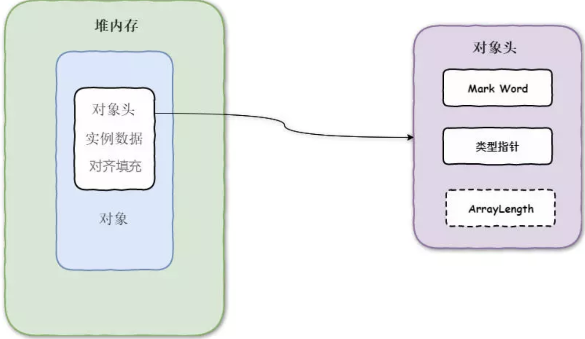
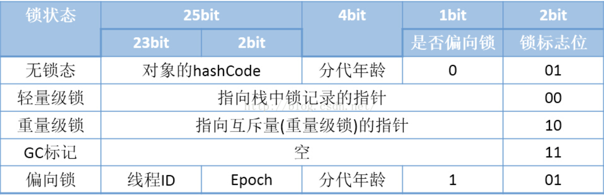

## 决战！Synchronized

#### 线程安全实现方法

> 线程安全的定义：当多个线程访问某个类时，不管运行时环境采用何种调度方式或者这些线程将如何交替执行，并且在主调代码中不需要任何额外的同步或协同，这个类都能表现出正确的行为，那么这个类就是线程安全的。

#### 互斥同步(悲观锁)

当一个共享数据被当前正在访问的线程加上互斥锁后，在同一个时刻，其他线程只能处于等待的状态，直到当前线程处理完毕释放该锁。

#### 非阻塞式同步（乐观锁）

互斥同步主要的问题就是进行线程阻塞和唤醒锁带来的性能问题，为了解决这性能问题，我们有另一种解决方案，当多个线程竞争某个共享数据时，没有获得锁的线程不会阻塞，而是不断的尝试去获取锁，直到成功为止。这种方案的原理就是使用**循环CAS操作**来实现。

#### synchronized3种使用方式

- 修饰普通的实例方法，对于普通的同步方法，锁是当前实例对象
- 修饰静态方法，对于静态同步方法，锁是当前类的Class对象
- 修饰代码块，对于同步方法块，锁是Synchronized配置的对象

#### Java对象的内存布局

在JVM中，对象在内存的存储的布局可以分为3块区域：对象头（Header)、实例数据（Instance Data)、对其填充（Padding)。其中虚拟机中的对象头包括三部分信息，分别为"Mark Word"、类型指针、记录数组长度的数据（可选），具体情况如下图所示：


#### Java对象头的组成

- Mark Word：存储对象自身的运行时数据。如哈希码（HashCode）、GC分代年龄、**锁状态标志**、线**程持有的锁**、偏向锁ID、偏向锁时间戳等，这部分的数据在长度32位与64位的虚拟机中分别为32bit和64bit，官方称为“Mark Word"。
- 类型指针：对象头的另一部分是类型指针，即对象指向它的类元数据的指针，虚拟机通过这个指针来确定这个对象是哪个类的实例。（**Java SE 1.6中为了减少获得锁和释放锁带来的性能消耗而引入的偏向锁和轻量级锁**)
- 记录数组长度数据：对象头剩下的一部分是用于记录数组长度的数据（如果当前对象不是数组，就没有这一部分数据），如果对象是一个Java数组，那在对象头中还必须有一块用于记录数组长度的数据。因为虚拟机可以通过普通Java对象的元数据信息来确定Java对象的大小，但是从数组中的元数据中无法确定数组的大小。



#### JVM中synchronized锁的优化

```
锁粗化（Lock Coarsening）：将多个连续的锁扩展成一个范围更大的锁，用以减少频繁互斥同步导致的性能损耗。

锁消除（Lock Elimination）：JVM及时编译器在运行时，通过逃逸分析，如果判断一段代码中，堆上的所有数据不会逃逸出去从来被其他线程访问到，就可以去除这些锁。

轻量级锁（Lightweight Locking）：JDK1.6引入。在没有多线程竞争的情况下避免重量级互斥锁，只需要依靠一条CAS原子指令就可以完成锁的获取及释放。

偏向锁（Biased Locking）：JDK1.6引入。目的是消除数据再无竞争情况下的同步原语。使用CAS记录获取它的线程。下一次同一个线程进入则偏向该线程，无需任何同步操作。

适应性自旋（Adaptive Spinning）：为了避免线程频繁挂起、恢复的状态切换消耗。产生了忙循环（循环时间固定），即自旋。JDK1.6引入了自适应自旋。自旋时间根据之前锁自旋时间和线程状态，动态变化，用以期望能减少阻塞的时间。
```

#### 线程获取共享资源的过程

第一步，检查MarkWord里面是否为自己的ThreadId ,如果是，表示当前线程处于 “偏向锁”.跳过轻量锁直接执行同步体。

第二步，如果MarkWord不是自己的ThreadId,锁升级，这时候，用CAS来执行切换，新的线程根据MarkWord里面现有的ThreadId，通知之前线程暂停，之前线程将Markword的内容置为空。

第三步，两个线程都把对象的HashCode复制到自己新建的用于存储锁的记录空间，接着开始通过CAS操作，把共享对象的MarKword的内容修改为自己新建的记录空间的地址的方式竞争MarkWord.

第四步，第三步中成功执行CAS的获得资源，失败的则进入自旋.

第五步，自旋的线程在自旋过程中，成功获得资源(即之前获的资源的线程执行完成并释放了共享资源)，则整个状态依然处于轻量级锁的状态，如果自旋失败，下一步

第六步，进入重量级锁的状态，这个时候，自旋的线程进行阻塞，等待之前线程执行完成并唤醒自己.

#### 深入！底层对这些锁的操作

###### 偏向锁

在锁对象的对象头中ThreadId字段，若该字段为空，首次获取锁的时候，将自身ThreadId写入锁的ThreadId字段，将偏向锁的状态位置1.下次获取锁的时候，直接检查ThreadId是否和自身线程Id一致，若一致，则认为当前线程已经获取了锁，略过了轻量级锁和重量级锁的加锁阶段。提高了效率。

###### 偏向锁---获取

1、通过`markOop mark = obj->mark()`获取对象的markOop数据mark，即对象头的Mark Word；
2、判断mark是否为可偏向状态，即mark的偏向锁标志位为 **1**，锁标志位为 **01**；
3、判断mark中JavaThread的状态：如果为空，则进入步骤（4）；如果指向当前线程，则执行同步代码块；如果指向其它线程，进入步骤（5）；
4、通过CAS原子指令设置mark中JavaThread为当前线程ID，若执行CAS成功，则执行同步代码块，否则进步骤（5）；
5、如果执行CAS失败，表示当前存在多个线程竞争锁，当达到全局安全点（safepoint），获得偏向锁的线程被挂起，撤销偏向锁，并升级为轻量级，升级完成后被阻塞在安全点的线程继续执行同步代码块；

###### 偏向锁---撤销

1、偏向锁的撤销动作必须等待全局**安全点**；(程序执行期间所有GC Root已知且所有堆对象的内容一致的点。)
2、暂停拥有偏向锁的线程，判断锁对象是否处于被锁定状态；
3、撤销偏向锁，恢复到无锁（标志位为 **01**）或轻量级锁（标志位为 **00**）的状态；

###### 轻量锁

线程在执行同步块之前，JVM会先在当前线程的栈桢中创建用于存储锁记录的空间，并将对象头中的Mark Word复制到锁记录中，官方称为**Displaced Mark Word**。然后线程尝试使用CAS将对象头中的Mark Word替换为指向该线程锁记录的指针。如果成功，当前线程获得锁，如果失败，表示其他线程竞争锁，当前线程便尝试使用自旋来获取锁。

###### 轻量锁---获取

1、`markOop mark = obj->mark()`方法获取对象的markOop数据mark；
2、`mark->is_neutral()`方法判断mark是否为无锁状态：mark的偏向锁标志位为 **0**，锁标志位为 **01**；
3、如果mark处于无锁状态，则进入步骤（4），否则执行步骤（6）；
4、把mark保存到BasicLock对象的_displaced_header字段；
5、通过CAS尝试将Mark Word更新为指向BasicLock对象的指针，如果更新成功，表示竞争到锁，则执行同步代码，否则执行步骤（6）；
6、如果当前mark处于加锁状态，且mark中的ptr指针指向当前线程的栈帧，则执行同步代码，否则说明有多个线程竞争轻量级锁，轻量级锁需要膨胀升级为重量级锁；

###### 轻量锁---撤销

1、获取线程堆栈中的Displaced Mark Word
2、如果线程堆栈中的Displaced Mark Word为null，如果已经为重量级锁，直接返回。
3、如果当前线程拥有轻量级锁，则通过CAS尝试把Displaced Mark Word替换到当前锁对象的Mark Word，如果CAS成功，说明成功的释放了锁
4、如果CAS失败，说明有其它线程在尝试获取该锁，这时需要将该锁升级为重量级锁，并释放；

###### 重量锁

轻量级解锁时，会使用原子的CAS操作将Displaced Mark Word替换回到对象头，如成功则表示没有竞争发生。如果失败，表示当前锁存在竞争，锁就会膨胀成重量级锁，重量级锁会导致竞争的线程**互斥同步。**

重量级锁的竞争是在objectMonitor.cpp中ObjectMonitor::enter()方法中实现的。

###### ObjectMonitor

**每个锁对象（这里指已经升级为重量级锁的对象）都有一个ObjectMonitor（对象监视器）**。也就是说每个线程获取锁对象都会通过ObjectMonitor，代码如下

```c++
class ObjectMonitor {
 public:
  enum {
    OM_OK,                    // 没有错误
    OM_SYSTEM_ERROR,          // 系统错误
    OM_ILLEGAL_MONITOR_STATE, // 监视器状态异常
    OM_INTERRUPTED,           // 当前线程已经中断
    OM_TIMED_OUT              // 线程等待超时
  };
  volatile markOop   _header;       // 线程帧栈中存储的 锁对象的mark word拷贝

 protected:                         // protected for JvmtiRawMonitor
  void *  volatile _owner;          // 指向获得objectMonitor的线程或者 BasicLock对象
  volatile jlong _previous_owner_tid;  // 上一个获得objectMonitor的线程id
  volatile intptr_t  _recursions;   // 同一线程重入锁的次数，如果是0，表示第一次进入
  ObjectWaiter * volatile _EntryList; // 在进入或者重进入阻塞状态下的线程链表
                             
 protected:
  ObjectWaiter * volatile _WaitSet; // 处于等待状态下的线程链表
  volatile jint  _waiters;          //处于等待状态下的线程个数

```

###### 重量锁---竞争

1. 通过CAS操作尝试吧monitor的_owner设置为当前线程，若CAS成功，表示线程获取锁成功，直接执行同步代码块。

2. 如果是同一线程重入锁，则记录当前重入的次数。

3. 如果2,3步骤都不满足，则开始竞争锁，走EnterI()方法。

   enterl（）方法：

   1. 把当前线程被封装成ObjectWaiter的node对象，同时将该线程状态设置为TS_CXQ（竞争状态） 

   2. 在for循环中，通过CAS把node节点push到_cxq链表中，如果CAS操作失败，继续尝试，是因为当期_cxq链表已经发生改变了继续for循环，如果成功直接返回。

   3. 将node节点push到_cxq链表之后，通过自旋尝试获取锁（TryLock方法获取锁)，如果循环一定次数后，还获取不到锁，则通过park函数挂起。（并不会消耗CPU资源）

      TryLock（）方法：将锁中的_owner指针指向当前线程，如果成功返回1，反之返回-1。

###### 重量锁---释放

1. 判断当前锁对象中_owner是否指向当前线程，若_owner指向的BasicLock在当前线程栈上,则将_owner指向当前线程。
2. 如果当前锁对象中的_owner指向当前线程，则判断当前线程重入锁的次数，如果不为0，那么就重新走ObjectMonitor::exit（），直到重入锁次数为0为止。
3. 释放当前锁，并根据QMode的模式判断，是否将_cxq中挂起的线程唤醒。还是其他操作。

#### 总结

1. 只有一个线程进入临界区，偏向锁
2. 多个线程交替进入临界区，轻量级锁
3. 多线程同时进入临界区，重量级锁