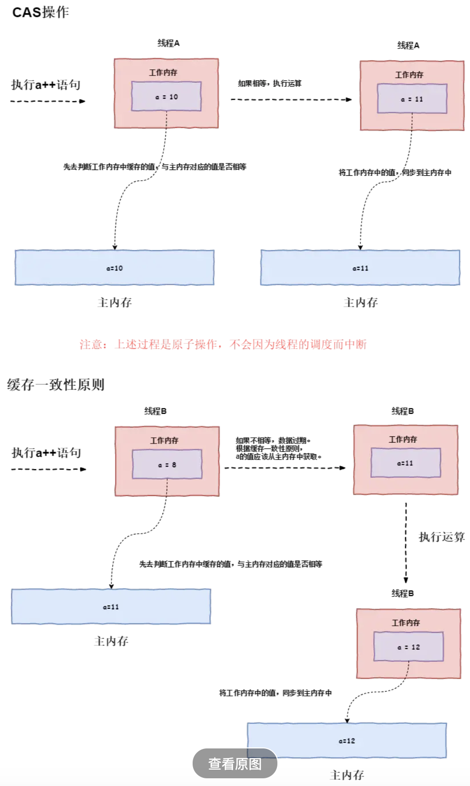

## 追击!CAS(Compare-and-Swap)

#### 缓存锁:(工作于物理机)

如果某个内存区域数据，已经同时被两个或以上处理器核缓存，缓存锁就会通过缓存一致性机制阻止对其修改，以此来保证操作的原子性，当其他处理器核回写已经被锁定的**缓存行**的数据时会导致该缓存行无效。

#### MESI协议:(缓存锁的机制,也即缓存一致性协议,伊利诺斯协议)

若干CPU核通过ringbus连到一起。每个核都维护自己的Cache的状态。如果对于同一份内存数据在多个核里都有cache，则状态都为S（shared）。一旦有一核改了这个数据（状态变成了M），其他核就能瞬间通过ringbus感知到这个修改，从而把自己的cache状态变成I（Invalid），并且从标记为M的cache中读过来。同时，这个数据会被原子的写回到主存。最终，cache的状态又会变为S。**PS:这相当于给cache本身单独做了一套总线，避免了真的锁总线。**

#### 缓存锁与CAS的关系:

为了实现缓存锁，Intel处理器提供了很多Lock**前缀**（注意是带Lock前缀，前缀）的指令.被这些指令操作的内存区域会加锁，使其他处理器不能同时访问。而在Java中涉及缓存锁的主要是CAS操作，正是使用了不同处理器提供的缓存锁指令。

#### CAS过程:

​	三个操作数:

​		内存地址（**在Java内存模型中可以简单理解为主内存中变量的内存地址**

​		旧值（**在Java内存模型中，可以理解工作内存中缓存的主内存的变量的值**）

​		新值

​	CAS操作执行时，当且仅当主内存对应的值等于旧值时，处理器用新值去更新旧值，否则它就不执行更新。但是无论是否更新了主内存中的值，都会返回旧值，上述的处理过程是一个原子操作。


#### CAS的java实现

简单的实现形式

```java
//cas实现++i
public final int incrementAndGet() {
    for (;;) {
        int current = get();
        int next = current + 1;
        if (compareAndSet(current, next))
            return next;
    }
}
```

主要由CAS操作由sun.misc.Unsafe类里面的compareAndSwapInt()和compareAndSwapLong()，compareAndSwapObject几个方法实现。

```java
//函数声明为
public final native boolean compareAndSetInt(Object o, long offset,int expected,int x);
//本地方法是在hotspot下的unsafe.cpp类具体实现的
//unsafe.cpp最终会调用atomic.cpp,它会根据不同的处理调用不同的处理器指令，以Intel的处理器为例，atomic.cpp最终会调用atomic_windows_x86.cpp中的operator()方法。
template<>
template<typename T>
inline T Atomic::PlatformCmpxchg<4>::operator()(T exchange_value,	//新值
                                                T volatile* dest,	//变量内存地址
                                                T compare_value,	//旧值
                                                atomic_memory_order order) const {
  STATIC_ASSERT(4 == sizeof(T));
  // alternative for InterlockedCompareExchange
  __asm {	//c++的汇编内联块
    mov edx, dest 	//edx为变量内存地址
    mov ecx, exchange_value	//ecx为新值
    mov eax, compare_value	//eax存旧值
    lock cmpxchg dword ptr [edx], ecx
  }
}
//dword ptr [edx]:取edx下的值,这里是内存里的变量
//lock:该操作会产生总线锁或缓存锁,禁止重排序,并且写缓冲区的所有数据刷新到内存中
//cmpxchg:即compare exchange:比较eax与第一操作数的值，如果相等，那么第二操作数的值装载到第一操作数，如果不相等，那么第一操作数的值装载到eax中
```

#### CAS的3大问题

- **ABA问题**:如果一个值原来是A，变成了B，又变成了A，那么使用CAS进行检查时会发现它的值没有发生变化，但是实际上却变化了。解决思路就是使用版本号,例如AtomicStampedReference类就是这么做的
- **循环开销太大**:自旋CAS，会一直循环直到获取到锁。如果自旋CAS长时间不成功，会给CPU带来非常大的执行开销。
- **只能保证一个共享变量的原子操作**:对多个共享变量操作时，自旋CAS无法保证操作的原子性，这个时候就可以用锁。或把多个共享变量合并成一个共享变量来操作。比如，两个共享变量i＝2，j=a，合并一下ij=2a，然后CAS来操作ij。