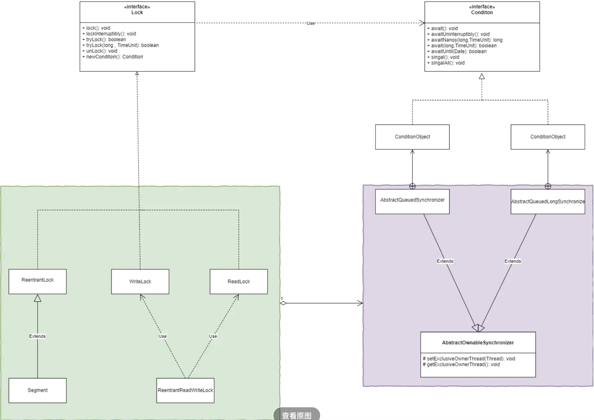

## 阵地转移！Lock()接口

#### 使用Lock接口实现的锁机制与使用传统的synchronized的区别

1. 尝试非阻塞地获取锁：当线程尝试获取锁，如果这一时刻锁没有被其他线程获取到，则成功获取并持有锁。

2. 能被中断的获取锁：与synchronized不同，获取到锁的线程能够响应中断，当获取到锁的线程被中断时，中断异常会被抛出，同时锁也会被释放。

3. 超时获取锁：在指定的截止时间之前获取锁，如果截止时间到了任然无法获取到锁，则返回。

   **注：不要将获取锁的过程写在try块中**

#### Lock相关实现类实现锁机制

e

上图中，

1. 绿色部分为：其中`ReentrantLock（重入锁）`、WriteLock、ReadLock都是Lock的实现类。`Segment为ReentrantLock的子类（ConcurrentHashMap）。``ReentrantReadWriteLock （读写锁）`的实现使用了WriteLock与ReadLock类。
2. 紫色部分为：其中`AbstractQueuedSynchronizer`与`AbstractQueuedLongSynchronizer`都为`AbstractOwnableSynchronizer`的子类，该两个类中都维护了一个同步队列，用于线程的并发执行。在该两个类中拥有名为`ConditionObject(为Conditon的实现类)`的内部类，只是其内部实现不同。在ConditionObject内部维护了一个等待队列，用于控制线程的等待与唤醒。

#### 一般实现

```java
class LockImpl implements Lock {

    private final sync mSync = new sync();
    @Override
    public void lock() {
        mSync.acquire(1);
    }
    @Override
    public void lockInterruptibly() throws InterruptedException {
        mSync.acquireInterruptibly(1);
    }

    @Override
    public boolean tryLock() {
        return mSync.tryAcquire(1);
    }

    @Override
    public boolean tryLock(long time, TimeUnit unit) throws InterruptedException {
        return mSync.tryAcquireNanos(1, unit.toNanos(time));
    }

    @Override
    public void unlock() {
        mSync.release(1);
    }

    @Override
    public Condition newCondition() {
        return mSync.newCondition();
    }
    
     //这里也可以继承AbstractQueuedLongSynchronizer
    private static class sync extends AbstractQueuedSynchronizer {
        @Override
        protected boolean isHeldExclusively() {...}//当前线程是否独占锁
        @Override
        protected boolean tryAcquire(int arg) {...}//独占式尝试获取同步状态，通过CAS操作设置同步状态，如果成功返回true，反之返回false
        @Override
        protected boolean tryRelease(int arg) {...}//独占式释放同步状态。
        @Override
        protected int tryAcquireShared(int arg) {...}//共享式的获取同步状态，返回大于等于0的值，表示获取成功，反之失败。
        @Override
        protected boolean tryReleaseShared(int arg) {...}//共享式释放同步状态。
        final ConditionObject newCondition() {...}
    }
}
```

可见，lock是对外暴露的接口，真正的实现细节在于AQS